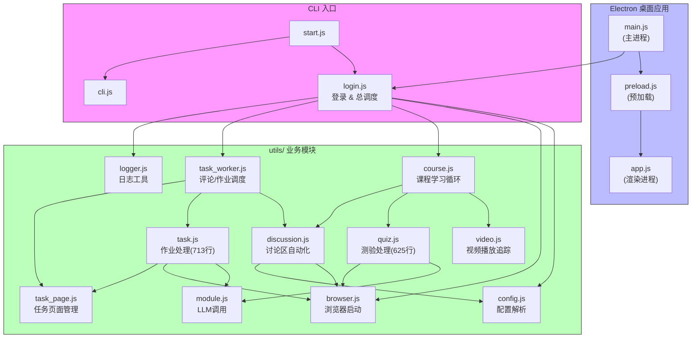
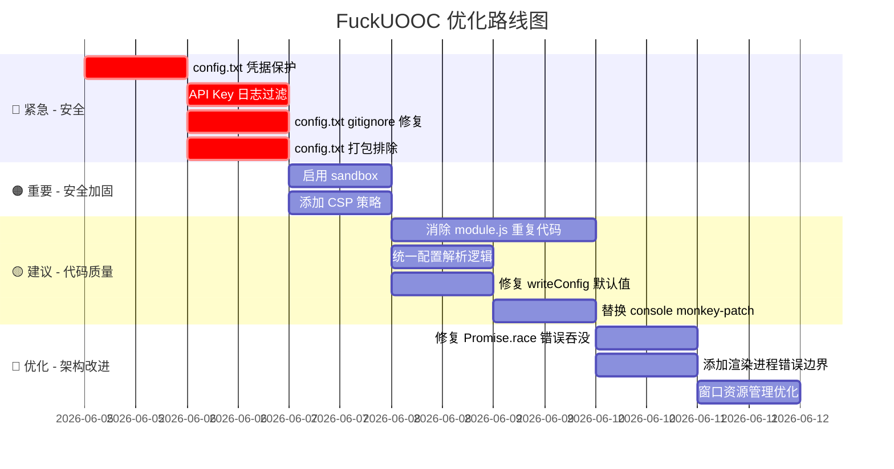

# FuckUOOC 项目优化审计报告

> 审计日期：2026-06-04  
> 审计范围：全量源代码（17 个 JS 文件 + 配置 + Electron 主/渲染进程）  
> 审计方法：静态代码审查 + 架构分析 + 模块依赖梳理

---

## 一、项目概览

### 1.1 技术栈

| 层级 | 技术 | 版本 |
|------|------|------|
| 桌面框架 | Electron | 28.0.0 |
| 浏览器自动化 | Playwright (Chromium) | 1.56.1 |
| 打包工具 | electron-builder | 24.13.3 |
| 运行时 | Node.js (Electron 内置) | 18.x |
| LLM 接口 | OpenAI 兼容 API (DeepSeek V4 Pro) | — |
| 配置存储 | INI 格式 config.txt | — |
| 数据存储 | 本地 JSON 文件 + PNG 截图 | — |

### 1.2 模块架构图



### 1.3 模块依赖关系表

| 模块 | 被引用者 | 核心职责 | 代码行数 |
|------|----------|----------|----------|
| `config.js` | login, browser, course, quiz, task, discussion, module, cli, video | 解析 config.txt 并导出配置常量 | 95 |
| `logger.js` | login | 彩色日志标签生成 | 20 |
| `browser.js` | login, quiz, task, discussion | Playwright 浏览器启动、反检测、验证码 | 106 |
| `login.js` | start.js, main.js | 登录流程 + 课程并发调度总入口 | 277 |
| `course.js` | login | 单门课程的学习循环（视频→测验→跳过非交互） | 361 |
| `video.js` | course | 视频播放、进度追踪、视频内弹题处理 | 192 |
| `quiz.js` | course | 测验处理、LLM答题、暴力穷举兜底 | 625 |
| `discussion.js` | course, task_worker | 讨论区浏览、评论冷却队列、回复管理 | 334 |
| `task.js` | task_worker | 作业获取、答题、提交、验证重试 | 713 |
| `task_page.js` | task_worker, task | 独立任务页面创建/恢复/安全导航 | 111 |
| `task_worker.js` | login | 评论+作业独立窗口自动调度 | 201 |
| `module.js` | quiz, task | LLM API 调用（选择题/主观题/文本题） | 251 |
| `cli.js` | start.js | CLI 交互式选项菜单 | 61 |

---

## 二、安全漏洞（按优先级排序）

---

### 🔴 P0-1：config.txt 明文存储账号密码与 API Key

**位置**：`config.txt` 第 2-3 行（凭据）、第 5 行（API Key）

**现状**：
```ini
# config.txt（实际内容）
USERNAME=13422764720
PASSWORD=L20060523
API_KEY=sk-ecdfc0ebdc5b410f85eaf2dd274ace6e
```

**影响**：
- 任何拥有文件系统读取权限的人（包括恶意软件、物理接触者）可直接获取 UOOC 账号密码和 DeepSeek API Key
- API Key 可被用于滥用调用额度、发起恶意请求
- 账号密码泄露可能导致课程数据被篡改或冒用身份

**修复方案**：

**方案 A：环境变量（推荐，最小改动）**
```javascript
// utils/config.js 修改
const USERNAME = process.env.UOOC_USERNAME || cfg.USERNAME;
const PASSWORD = process.env.UOOC_PASSWORD || cfg.PASSWORD;
const API_KEY = process.env.LLM_API_KEY || cfg.API_KEY;
```
用户通过系统环境变量或 `.env` 文件（不入库）注入凭据。

**方案 B：Electron safeStorage 加密存储（GUI 模式最佳）**
```javascript
// electron/main.js
const { safeStorage } = require('electron');

function readSecureConfig() {
    const cfg = readConfig();
    if (cfg.ENCRYPTED_PASSWORD && safeStorage.isEncryptionAvailable()) {
        cfg.PASSWORD = safeStorage.decryptString(Buffer.from(cfg.ENCRYPTED_PASSWORD, 'base64'));
    }
    return cfg;
}

function writeSecureConfig(cfg) {
    if (cfg.PASSWORD && safeStorage.isEncryptionAvailable()) {
        cfg.ENCRYPTED_PASSWORD = safeStorage.encryptString(cfg.PASSWORD).toString('base64');
        delete cfg.PASSWORD;
    }
    writeConfig(cfg);
}
```

**预期效果**：消除凭据明文存储，将攻击面从"文件读取即可获取"提升至"需要进程级内存访问"。

---

### 🔴 P0-2：API Key 可能在日志中泄露

**位置**：`utils/module.js` 第 43-49、122-129、208-217 行

**现状**：
```javascript
// module.js — 三个 LLM 函数均使用相同模式
const resp = await fetch(API_BASE_URL, {
    headers: {
        'Authorization': `Bearer ${API_KEY}`,
        'Content-Type': 'application/json'
    },
    body: JSON.stringify(body),  // 若 body 被意外日志输出，不会直接泄露 Key
    signal: controller.signal
});

// 但 main.js 中 console.log 被 monkey-patch 全局转发到日志：
console.log = (...args) => {
    const message = args.map(a => typeof a === 'string' ? a : JSON.stringify(a)).join(' ');
    logEmitter.emit('log', { level: 'info', message, timestamp: Date.now() });
};
```

**影响**：
- 若任何模块通过 `console.log` 输出完整的 `headers` 或请求配置对象，API Key 将被记录到 `sessionLogs` 缓存和日志文件中
- 用户导出日志分享调试信息时可能无意中泄露 Key

**修复方案**：
1. **日志过滤器**：在 `main.js` 的 console monkey-patch 中增加敏感信息过滤
```javascript
const SENSITIVE_PATTERNS = [
    /sk-[a-zA-Z0-9]{20,}/g,
    /Bearer\s+[^\s"']+/g,
    /"password":\s*"[^"]+"/gi,
];

function sanitizeLogMessage(message) {
    let sanitized = message;
    for (const pattern of SENSITIVE_PATTERNS) {
        sanitized = sanitized.replace(pattern, '***REDACTED***');
    }
    return sanitized;
}
```
2. **禁止 console.log 输出请求对象**：在 `module.js` 中使用专用 logger 而非 `console.log`

**预期效果**：即使代码意外打印了敏感信息，也不会持久化到日志文件中。

---

### 🔴 P0-3：config.txt 未被 .gitignore 保护且已 staged

**位置**：`.gitignore`、`git status`

**现状**：
```gitignore
# .gitignore 当前内容，缺少 config.txt
data/
node_modules/
.codex/
.codebuddy/
dist/
out/
*.exe
```

Git 状态显示：
```
Changes to be committed:
    modified:   config.txt
```

**影响**：
- `config.txt` 包含真实凭据且已被 `git add` 暂存，一旦提交即永久保留在 Git 历史中
- 即使后续添加 `.gitignore`，历史记录中的凭据仍可通过 `git log -p` 找回

**修复方案**：
1. **立即从暂存区移除**：`git rm --cached config.txt`
2. **添加至 .gitignore**：追加 `config.txt` 行
3. **（如已提交历史）轮换所有凭据**：更换 UOOC 密码和 API Key，并使用 `git filter-branch` 或 `BFG Repo-Cleaner` 清理历史
4. **创建 config.example.txt** 作为配置模板分发

**预期效果**：阻止凭据进入远程仓库，减少二次泄露风险。

---

### 🟠 P1-4：渲染进程 sandbox:false 未隔离

**位置**：`electron/main.js` 第 293 行

**现状**：
```javascript
// main.js:279-296
mainWindow = new BrowserWindow({
    // ...
    webPreferences: {
        preload: path.join(__dirname, 'preload.js'),
        contextIsolation: true,   // ✅ 上下文隔离已开启
        nodeIntegration: false,   // ✅ Node 集成已关闭
        sandbox: false            // ❌ 沙箱未启用
    },
});
```

**影响**：
- 虽然 `contextIsolation: true` 阻止了直接访问 Node.js API，但 `sandbox: false` 意味着渲染进程仍拥有系统级权限
- 若存在 XSS 漏洞（如通过日志消息注入恶意脚本），攻击者可能利用 preload 暴露的 IPC 通道执行敏感操作（读写配置、启动任务等）
- Electron 官方从 v28 起默认启用沙箱，显式设为 false 是有意削弱安全性

**修复方案**：
1. 将 `sandbox: true` 启用
2. 验证 preload.js 中通过 `contextBridge` 暴露的所有 API 在沙箱环境下正常工作
3. 若某些功能需要访问 Node API，将它们移到主进程并通过 IPC 暴露（当前架构已基本符合此模式，仅需移除 `sandbox: false`）

```javascript
webPreferences: {
    preload: path.join(__dirname, 'preload.js'),
    contextIsolation: true,
    nodeIntegration: false,
    sandbox: true             // ✅ 启用沙箱
},
```

**预期效果**：渲染进程被 OS 级沙箱隔离，XSS 攻击面大幅缩小，符合 Electron 安全最佳实践。

---

### 🟠 P1-5：缺少 Content Security Policy（CSP）

**位置**：`electron/renderer/index.html`（574行，无 CSP 标签）

**现状**：
HTML 文件中未设置任何 CSP 策略，渲染进程可加载来自任意来源的脚本、样式和图片。

**影响**：
- 缺少对 XSS 攻击的最后一道防线
- 内联脚本和 `eval()` 可被利用执行恶意代码
- 无法限制资源加载来源

**修复方案**：
在 `index.html` 的 `<head>` 中添加 CSP meta 标签：

```html
<meta http-equiv="Content-Security-Policy" 
      content="default-src 'self'; 
               style-src 'self' 'unsafe-inline'; 
               script-src 'self'; 
               img-src 'self' data:; 
               font-src 'self'; 
               connect-src 'self';">
```

或在 `main.js` 中通过 HTTP 头设置：
```javascript
mainWindow.webContents.session.webRequest.onHeadersReceived((details, callback) => {
    callback({
        responseHeaders: {
            ...details.responseHeaders,
            'Content-Security-Policy': [
                "default-src 'self'; style-src 'self' 'unsafe-inline'; script-src 'self'"
            ]
        }
    });
});
```

**预期效果**：提供深度防御，即使在 XSS 注入成功后也能限制攻击代码的执行能力。

---

### 🟠 P1-6：config.txt 随 electron-builder 打包分发

**位置**：`package.json` 第 21-27 行

**现状**：
```json
"build": {
    "files": [
        "electron/**/*",
        "utils/**/*",
        "start.js",
        "config.txt",       // ❌ 被打包进 asar
        "package.json"
    ]
}
```

**影响**：
- 构建产物中包含开发者的 `config.txt`，分发 `.exe` 给他人时将泄露凭据
- asar 包可被解压还原，凭据不能通过打包来"隐藏"

**修复方案**：
```json
"build": {
    "files": [
        "electron/**/*",
        "utils/**/*",
        "start.js",
        "config.example.txt",    // ✅ 仅打包配置模板
        "package.json"
    ]
}
```
创建 `config.example.txt` 作为无凭据的模板。应用首次启动时若检测不到 `config.txt`，自动从模板复制。

**预期效果**：分发包不包含任何凭据，用户需自行填写配置。

---

### 🟠 P1-7：data/ 目录用户数据未加密

**位置**：`utils/config.js` 第 69-70 行

**现状**：
```javascript
const DATA_DIR = path.join(__dirname, '..', 'data', USERNAME);
fs.mkdirSync(DATA_DIR, { recursive: true });
```

data/ 目录下存储：
- 视频观看记录（`data/<courseId>.txt`）— `utils/video.js`
- 作业截图（`data/<USERNAME>/homework_*.png`）— `utils/quiz.js`
- 讨论状态（`data/<USERNAME>/discussion_state.json`）— `utils/discussion.js`

**影响**：
- 截图包含用户的课程答案、个人信息，任何有文件系统权限的人可读取
- 没有加密存储机制

**修复方案**：
1. 低优先级（当前阶段）：确保 `data/` 仅被 `.gitignore` 排除（已实现）
2. 中优先级：使用 Electron `safeStorage` 对敏感文件加密
3. 高优先级：在应用退出或任务结束时清理临时截图

**预期效果**：配合 gitignore 和文件权限，当前风险可控。长期建议加密或自动清理。

---

### 🟡 P2-8：writeConfig() 覆盖用户注释且默认模型值过期

**位置**：`electron/main.js` 第 45-89 行

**现状**：
```javascript
function writeConfig(cfg) {
    const lines = [];
    lines.push('# UOOC 账号');
    // ...
    lines.push(`MODEL=${cfg.MODEL || 'doubao-seed-2-0-mini-260215'}`);    // ❌ 过期默认值
    lines.push(`RETRY_MODEL=${cfg.RETRY_MODEL || 'doubao-seed-2-0-lite-260215'}`); // ❌ 过期默认值
    lines.push(`BASE_URL=${cfg.BASE_URL || 'https://ark.cn-beijing.volces.com/api/v3/chat/completions'}`); // ❌ 过期默认值
    // ...
    fs.writeFileSync(CONFIG_PATH, lines.join('\n'), 'utf-8');
}
```

而实际 `config.txt` 当前使用的是：
```ini
MODEL=deepseek-v4-pro
RETRY_MODEL=deepseek-v4-pro
BASE_URL=https://api.deepseek.com/v1/chat/completions
```

**影响**：
- 用户通过 GUI 保存配置时，如果模型字段为空，会被错误地回退到过期默认值
- 整个 config 文件被重新生成，用户添加的自定义注释全部丢失
- **最严重的情况**：如果用户清空模型名想用默认值，会被设成已不可用的 doubao 模型，导致所有答题失败

**修复方案**：
```javascript
function writeConfig(cfg) {
    // 1. 先读取原始文件
    const originalContent = fs.existsSync(CONFIG_PATH) 
        ? fs.readFileSync(CONFIG_PATH, 'utf-8') 
        : '';
    
    // 2. 按行更新，保留注释
    const updated = updateIniValues(originalContent, cfg);
    
    // 3. 如果文件不存在，生成带正确默认值的新文件
    const content = updated || generateDefaultConfig(cfg);
    fs.writeFileSync(CONFIG_PATH, content, 'utf-8');
}

function generateDefaultConfig(cfg) {
    // 默认值从 config.js 中导入，保持单一真相来源
    return `MODEL=${cfg.MODEL || 'deepseek-v4-pro'}\n` +
           `RETRY_MODEL=${cfg.RETRY_MODEL || 'deepseek-v4-pro'}\n` +
           `BASE_URL=${cfg.BASE_URL || 'https://api.deepseek.com/v1/chat/completions'}\n`;
}
```

或更简单的方案：**让 `electron-builder` 打包时的默认值与 `utils/config.js` 一致**，保持单一真相来源：
```javascript
// main.js 从 config.js 导入默认值
const { MODEL_NAME, RETRY_MODEL, API_BASE_URL } = require('../utils/config');
// 然后在 writeConfig 中使用这些值
```

**预期效果**：GUI 保存配置不会意外修改生效配置，用户注释得以保留。

---

### 🟡 P2-9：console.log/console.error monkey-patch 全局污染

**位置**：`electron/main.js` 第 198-210 行

**现状**：
```javascript
// TaskRunner.start() 中
const originalLog = console.log;
const originalError = console.error;

console.log = (...args) => {
    originalLog(...args);
    const message = args.map(a => typeof a === 'string' ? a : JSON.stringify(a)).join(' ');
    logEmitter.emit('log', { level: 'info', message, timestamp: Date.now() });
};
console.error = (...args) => {
    originalError(...args);
    const message = args.map(a => typeof a === 'string' ? a : JSON.stringify(a)).join(' ');
    logEmitter.emit('log', { level: 'error', message, timestamp: Date.now() });
};
```

**影响**：
- 修改全局 `console` 对象是反模式，影响整个 Node.js 进程的所有模块
- 如果 `originalError` 引用在某些异常路径下丢失，错误日志将丢失
- `JSON.stringify` 对循环引用、BigInt 等类型会抛出异常，打断日志链路
- 任务异常退出（未执行 finally 恢复）时，console 永远被覆写

**修复方案**：
1. **使用专用日志函数而非修改全局 console**：
```javascript
// 创建新的 logger.js（覆盖现有的）
const { EventEmitter } = require('events');
const logEmitter = new EventEmitter();

function createLogger(tag) {
    return {
        log: (...args) => {
            const message = args.map(a => 
                typeof a === 'string' ? a : safeStringify(a)
            ).join(' ');
            console.log(`[${tag}]`, ...args); // 保留终端输出
            logEmitter.emit('log', { level: 'info', message, tag, timestamp: Date.now() });
        },
        error: (...args) => {
            const message = args.map(a => 
                a instanceof Error ? a.message : safeStringify(a)
            ).join(' ');
            console.error(`[${tag}]`, ...args);
            logEmitter.emit('log', { level: 'error', message, tag, timestamp: Date.now() });
        }
    };
}

function safeStringify(obj) {
    try { return JSON.stringify(obj); } 
    catch { return String(obj); }
}
```

2. **将 logger 实例注入业务模块，而非依赖全局 console**：
```javascript
// 各 utils 模块从接收 log 参数改为接收 logger 对象
async function learnCourse(page, courseId, logger, options) {
    logger.log('开始学习...');
    // ...
}
```

**预期效果**：消除全局副作用，日志系统与业务逻辑解耦，任务异常不会影响进程级日志能力。

---

### 🟡 P2-10：渲染进程 innerHTML 模板拼接存在 XSS 隐患

**位置**：`electron/renderer/app.js` 第 130-135、303-308 行

**现状**：
```javascript
// 活动记录渲染（第130-135行）
list.innerHTML = state.activities.map(a => `
    <div class="activity-item">
        <span class="activity-time">${a.time}</span>
        <span class="activity-content">${escapeHtml(a.message)}</span>
    </div>
`).join('');

// 日志条目渲染（第303-308行）
div.innerHTML = `
    <span class="log-time">${time}</span>
    <span class="log-level log-level-${entry.level}">${entry.level.toUpperCase()}</span>
    ${courseTag}
    <span class="log-message">${escapeHtml(entry.message)}</span>
`;
```

**影响**：
- `a.time` 和 `entry.level` 未经过 `escapeHtml` 处理，直接拼入 innerHTML
- 虽然 `a.time` 来自 `toLocaleTimeString()`（可信源），`entry.level` 来自程序逻辑，但这是依赖隐式假设
- `courseTag` 使用了 `escapeHtml` 但作为 HTML 片段注入，如果 courseName 本身包含 HTML 实体可能导致双重编码

**修复方案**：
1. 对所有插入 innerHTML 的变量统一使用 `escapeHtml`
2. 或使用 `textContent` + DOM API 构建元素，完全避免 HTML 注入：
```javascript
function renderLogEntry(entry) {
    const div = document.createElement('div');
    div.className = 'log-entry';

    const timeSpan = document.createElement('span');
    timeSpan.className = 'log-time';
    timeSpan.textContent = time; // textContent 自动转义
    div.appendChild(timeSpan);

    const levelSpan = document.createElement('span');
    levelSpan.className = `log-level log-level-${entry.level}`; // level 由程序控制，非用户输入
    levelSpan.textContent = entry.level.toUpperCase();
    div.appendChild(levelSpan);

    if (entry.courseName) {
        const tagSpan = document.createElement('span');
        tagSpan.className = 'log-course-tag';
        tagSpan.textContent = entry.courseName;
        div.appendChild(tagSpan);
    }

    const msgSpan = document.createElement('span');
    msgSpan.className = 'log-message';
    msgSpan.textContent = entry.message;
    div.appendChild(msgSpan);

    output.appendChild(div);
}
```

**预期效果**：彻底消除 XSS 注入面，不依赖隐式信任假设。

---

## 三、冗余裁减

---

### 3.1 未使用/冗余文件

| 文件 | 大小 | 问题 | 建议 |
|------|------|------|------|
| `utils/cli.js` | 2KB | 仅被 `start.js`（CLI 入口）引用；GUI 模式下完全无用但被 `"utils/**/*"` 规则打包 | 排除出 electron-builder 打包，或通过条件引用 |
| `electron/renderer/icon.psd` | 167KB | Photoshop 设计源文件，非运行时依赖 | 从仓库移除或加入 `.gitignore`；打包时排除 |
| `launch-hidden.vbs` | 599B | Windows 专用启动脚本，非核心功能 | 保留但因 `.vbs` 不在打包规则中，不影响分发体积 |
| `launch-hidden.vbs - 快捷方式.lnk` | 1.15KB | Windows 快捷方式文件，不应入库 | `.gitignore` 添加 `*.lnk` |
| `create-shortcut.ps1` | 2KB | 辅助脚本，功能边缘 | 可选保留 |
| `dist/win-unpacked/` | 目录 | 本地构建产物残留在源目录 | `.gitignore` 已配置 `dist/`，检查是否有未追踪文件 |

**打包体积优化**：
```json
// package.json 优化后的 files 规则
"build": {
    "files": [
        "electron/**/*",
        "!electron/renderer/icon.psd",    // 排除 PSD 源文件
        "utils/**/*",
        "!utils/cli.js",                  // GUI 模式排除 CLI 模块
        "start.js",
        "config.example.txt",
        "package.json"
    ]
}
```

**预期效果**：预计减少打包体积 ~170KB（icon.psd 167KB + cli.js 2KB + 零碎排除项）。

---

### 3.2 module.js 中重复的 LLM 调用逻辑

**位置**：`utils/module.js`
- `getAnswersFromImage()`（第 7-85 行）
- `getSubjectiveAnswers()`（第 87-162 行）
- `getTextAnswersFromImage()`（第 164-248 行）

**现状**：三个函数各自实现了几乎完全相同的 fetch/retry/timeout/JSON 解析流程，约 200 行重复代码：

```
每个函数的重复逻辑：
1. 构建请求 body（model, temperature, thinking, messages）
2. 循环 maxRetries 次：
   a. 创建 AbortController + 600s 超时
   b. fetch(API_BASE_URL, { headers: Authorization, body })
   c. 检查 resp.ok，否则 5s 后重试
   d. 解析 resp.json()
   e. 提取 content → JSON → answers 数组
3. 错误处理（AbortError、网络错误）
4. 返回 [] 作为兜底
```

**修复方案**：抽取公共的 LLM 调用函数：
```javascript
// 抽取的公共函数
async function callLLM({ messages, model, temperature, reasoningEffort }, log) {
    const body = {
        model: model || MODEL_NAME,
        temperature: temperature ?? 0,
        top_p: 1,
        thinking: { type: 'enabled' },
        reasoning_effort: reasoningEffort || 'high',
        stream: false,
        messages
    };

    const maxRetries = 3;
    for (let attempt = 0; attempt < maxRetries; attempt++) {
        try {
            const controller = new AbortController();
            const timeoutId = setTimeout(() => controller.abort(), 600000);

            const resp = await fetch(API_BASE_URL, {
                method: 'POST',
                headers: {
                    'Authorization': `Bearer ${API_KEY}`,
                    'Content-Type': 'application/json'
                },
                body: JSON.stringify(body),
                signal: controller.signal
            });
            clearTimeout(timeoutId);

            if (!resp.ok) {
                const errText = await resp.text().catch(() => '');
                throw new Error(`HTTP ${resp.status}: ${errText}`);
            }

            const data = await resp.json();
            const content = extractContent(data);
            return parseJSONAnswers(content);
        } catch (err) {
            if (err.name === 'AbortError') {
                log(`❌ 请求超时 (${attempt + 1}/${maxRetries})`);
            } else {
                log(`❌ 请求出错: ${err.message} (${attempt + 1}/${maxRetries})`);
            }
            if (attempt < maxRetries - 1) {
                await new Promise(r => setTimeout(r, 5000));
            }
        }
    }
    return [];
}

// 各业务函数变得极其简洁
async function getAnswersFromImage(imagePath, questionType, log, options = {}) {
    const imageBase64 = readImageAsBase64(imagePath, log);
    if (!imageBase64) return [];

    return callLLM({
        messages: [{
            role: 'user',
            content: [
                { type: 'text', text: QUIZ_PROMPT + (questionType ? `\n\n题型提示：${questionType}` : '') },
                { type: 'image_url', image_url: { url: `data:image/png;base64,${imageBase64}` } }
            ]
        }],
        model: options.model,
        reasoningEffort: options.reasoningEffort || 'high'
    }, log);
}

async function getSubjectiveAnswers(questionText, answerCount, log, options = {}) {
    return callLLM({
        messages: [{
            role: 'user',
            content: buildSubjectivePrompt(questionText, answerCount)
        }],
        temperature: 0.2
    }, log);
}
```

**预期效果**：
- `module.js` 从 251 行缩减至约 120 行（减少 ~50%）
- 消除 3 处重复的错误处理和重试逻辑
- 未来新增 LLM 调用场景只需组装 prompt，无需重复写网络层代码
- Bug 修复只需改一处

---

### 3.3 config.txt 重复解析逻辑

**位置**：
- `utils/config.js`（第 1-17 行）— INI 解析 + 导出常量
- `electron/main.js`（第 30-43 行）— 独立实现的 `readConfig()`
- `electron/main.js`（第 45-89 行）— 独立实现的 `writeConfig()`

**现状**：主进程和业务模块各有一套配置读写逻辑，互不共享：

| 功能 | config.js | main.js |
|------|-----------|---------|
| readConfig | ✅ 逐行解析，值非空才存 | ✅ 逐行解析（逻辑略有不同） |
| writeConfig | ❌ 无 | ✅ 全量重写（带过期默认值） |
| 环境变量支持 | ✅ `process.env[name]` 备选 | ❌ 无 |
| 默认值 | ✅ 在导出时指定 | ✅ 在 writeConfig 中硬编码 |

**修复方案**：统一为 `utils/config.js` 管理的配置系统：

```javascript
// utils/config.js 增加 writeConfig 和模块化 readConfig
function readConfig() {
    const cfg = {};
    if (!fs.existsSync(cfgPath)) return cfg;
    for (const line of fs.readFileSync(cfgPath, 'utf-8').split('\n')) {
        const trimmed = line.trim();
        if (!trimmed || trimmed.startsWith('#')) continue;
        const idx = trimmed.indexOf('=');
        if (idx <= 0) continue;
        const key = trimmed.slice(0, idx).trim();
        const val = trimmed.slice(idx + 1).trim();
        if (key) cfg[key] = val;
    }
    return cfg;
}

function writeConfig(cfg, options = {}) {
    const preserveComments = options.preserveComments !== false;
    if (preserveComments && fs.existsSync(cfgPath)) {
        // 原地更新模式：逐行替换值，保留注释
        return updateInPlace(cfgPath, cfg);
    }
    // 全量重写模式（使用 config.js 中的默认值常量）
    return generateNewConfig(cfgPath, cfg);
}

module.exports = {
    // ... 现有导出
    readConfig,
    writeConfig
};
```

然后在 `electron/main.js` 中直接使用：
```javascript
const { readConfig, writeConfig } = require('../utils/config');
```

**预期效果**：
- 消除约 80 行重复代码
- 配置读写行为一致，默认值从单一来源获取
- 新增配置项只需在 config.js 中添加一次

---

### 3.4 console.log/error 参数序列化重复逻辑

**位置**：`electron/main.js` 第 201-209 行

**现状**：
```javascript
// console.log 的 handler
const message = args.map(a => typeof a === 'string' ? a : JSON.stringify(a)).join(' ');

// console.error 的 handler（完全相同的序列化逻辑）
const message = args.map(a => typeof a === 'string' ? a : JSON.stringify(a)).join(' ');
```

**修复方案**：提取为公共工具函数（见 P2-9 的 `safeStringify` 方案）。

---

## 四、架构设计缺陷

---

### 4.1 课程并发调度 Promise.race 可能静默吞错误

**位置**：`utils/login.js` 第 240-252 行

**现状**：
```javascript
const pending = new Set();
const queue = courses.map((course, index) => () => processCourse(course, index));

for (const task of queue) {
    if (browserDisconnected) break;
    if (pending.size >= COURSE_CONCURRENCY) {
        await Promise.race(pending);  // ❌ race 完成后不检查是被 resolve 还是 reject
    }
    const promise = task().then(
        () => pending.delete(promise),
        () => pending.delete(promise)  // ❌ 错误被静默删除，不做记录
    );
    pending.add(promise);
}
await Promise.all(pending);
```

**影响**：
- 当并发数 >= 2 时，某个课程的 `processCourse` 抛出异常后，该异常不触发任何日志
- `Promise.race` 返回后只删除了 Set 中的条目，未检查竞争结果
- 用户无法从日志中知道有课程处理失败

**修复方案**：
```javascript
const pending = new Set();
let failedCount = 0;
const queue = courses.map((course, index) => () => processCourse(course, index));

for (const task of queue) {
    if (browserDisconnected) break;

    if (pending.size >= COURSE_CONCURRENCY) {
        try {
            await Promise.race(pending);
        } catch (err) {
            // race 中被 reject 的 promise 也需要处理
            console.error(`并发任务异常: ${err.message}`);
        }
    }

    const promise = task().catch(err => {
        console.error(`课程 ${courses[...].name} 处理异常: ${err.message}`);
        onStats({ failedCourses: ++failedCount });
    }).finally(() => {
        pending.delete(promise);
    });
    pending.add(promise);
}

// 等待所有任务完成，收集剩余错误
const results = await Promise.allSettled(pending);
for (const result of results) {
    if (result.status === 'rejected') {
        console.error(`课程任务失败: ${result.reason?.message}`);
    }
}
```

**预期效果**：所有课程处理异常都被正确捕获和记录，用户可在日志中明确看到失败详情。

---

### 4.2 渲染进程无全局错误边界

**位置**：`electron/renderer/app.js`（整个 IIFE）

**现状**：`app.js` 是一个自执行函数 `(function() { ... })()`，没有 `window.onerror` 或 `unhandledrejection` 处理。

**影响**：
- 渲染进程中的任何未捕获异常都会导致功能静默失效，用户不会看到任何提示
- 例如：DOM 元素不存在时 `$('#some-id').addEventListener(...)` 抛 TypeError，后续初始化全部中断

**修复方案**：
```javascript
// 在 init() 之前添加
window.addEventListener('error', (event) => {
    console.error('渲染进程未捕获错误:', event.error?.message || event.message);
    // 通过 electronAPI 通知主进程记录错误日志
    addActivity(`[错误] ${event.error?.message || '未知错误'}`);
});

window.addEventListener('unhandledrejection', (event) => {
    console.error('未处理的 Promise 拒绝:', event.reason?.message);
    addActivity(`[错误] ${event.reason?.message || '未知 Promise 错误'}`);
});
```

**预期效果**：异常可视化，用户和开发者可及时感知问题。

---

### 4.3 窗口关闭为 hide() 而非 close()，资源泄漏风险

**位置**：`electron/main.js` 第 370 行

**现状**：
```javascript
ipcMain.on('window:close', () => mainWindow?.hide());  // 仅隐藏，不销毁

app.on('window-all-closed', () => {
    // 不退出，保持托盘运行  // 但实际上窗口从未被 close
});
```

**影响**：
- 窗口隐藏后 `mainWindow` 仍持有引用，其 webContents 继续占用内存
- 若用户反复打开/关闭窗口，内存只增不减
- `app.on('window-all-closed')` 的回调永远不会被触发（因为窗口从未被 close，只是 hide）

**修复方案**：
1. 区分"关闭到托盘"和"退出应用"：
```javascript
ipcMain.on('window:close', () => {
    mainWindow?.hide();  // 关闭到托盘：隐藏
});

// 在托盘退出菜单中：
{ label: '退出', click: () => {
    if (mainWindow) {
        mainWindow.close();  // 真正销毁
        mainWindow = null;
    }
    app.quit();
}}

// 窗口关闭事件处理
mainWindow.on('closed', () => {
    mainWindow = null;  // 已经是这样，但只有真正 close 才能触发
});
```

或使用 `mainWindow.destroy()` 释放资源后重建：
```javascript
ipcMain.on('window:close', () => {
    if (mainWindow) {
        mainWindow.destroy(); // 彻底销毁并释放资源
        mainWindow = null;
    }
});

// 从托盘恢复时重新创建
{ label: '显示主窗口', click: () => {
    if (!mainWindow) mainWindow = createMainWindow();
    else mainWindow.show();
}}
```

**预期效果**：减少长期运行时的内存泄漏风险，窗口资源在关闭后得到正确释放。

---

### 4.4 无 Playwright 浏览器进程优雅关闭

**位置**：`utils/login.js` 第 267-273 行、`electron/main.js` 第 461-465 行

**现状**：
```javascript
// login.js finally 块
if (!browserDisconnected) {
    try { await browser.close(); } catch {}  // 仅关闭浏览器对象
}

// main.js
app.on('before-quit', () => {
    if (taskRunner?.running) {
        taskRunner.stop();  // stop() 只改标志位，不等待浏览器关闭
    }
});
```

**影响**：
- 如果用户强制退出应用（非正常结束任务），Playwright 的 Chromium 子进程可能成为僵尸进程
- `browser.close()` 被 try-catch 忽略异常，即使关闭失败也无人知晓

**修复方案**：
```javascript
// main.js
let browserProcess = null; // 保存浏览器进程引用

app.on('before-quit', async (event) => {
    if (taskRunner?.running) {
        event.preventDefault(); // 阻止立即退出
        taskRunner.stop();
        // 等待浏览器关闭（最多 5 秒）
        await Promise.race([
            browserProcess?.close(),
            new Promise(r => setTimeout(r, 5000))
        ]);
        app.quit();
    }
});
```

或在任务启动时将 browser 实例传递给 TaskRunner，在 stop 时等待关闭。

**预期效果**：避免浏览器进程泄漏，确保应用退出时清理所有子进程。

---

## 五、优化优先级路线图



| 优先级 | 阶段 | 估计工时 | 核心交付物 |
|--------|------|----------|------------|
| 🔴 P0 | 凭据安全 | 1-2 天 | 凭据不再明文存储；config.txt 从 git 历史移除；分发包不含凭据 |
| 🟠 P1 | 应用加固 | 1 天 | sandbox:true；CSP 策略；用户数据隔离 |
| 🟡 P2 | 代码质量 | 2-3 天 | module.js 重构；配置统一；console 解耦 |
| 🔵 优化 | 架构改进 | 2 天 | 错误处理完善；资源管理优化；内存泄漏修复 |

---

## 六、附录

### 6.1 完整文件清单

| 路径 | 类型 | 大小 | 用途 | 优化建议 |
|------|------|------|------|----------|
| `start.js` | CLI | 301B | CLI 入口 | 保留 |
| `config.txt` | 配置 | 747B | 用户配置（含凭据） | ⚠️ 移除凭据 |
| `package.json` | 配置 | 971B | 项目定义 | 修复 build.files |
| `package-lock.json` | 锁文件 | 148KB | 依赖锁定 | 保留 |
| `.gitignore` | 配置 | 64B | Git 排除规则 | 添加 config.txt |
| `README.md` | 文档 | 8KB | 项目文档 | 保留 |
| `LICENSE` | 文档 | 1KB | MIT 许可证 | 保留 |
| `原理.md` | 文档 | 16KB | 技术原理 | 可选保留 |
| `create-shortcut.ps1` | 脚本 | 2KB | 创建桌面快捷方式 | 可选保留 |
| `launch-hidden.vbs` | 脚本 | 599B | 隐藏启动 | 可选保留 |
| `launch-hidden.vbs - 快捷方式.lnk` | 快捷方式 | 1KB | Windows .lnk | ⚠️ gitignore |
| `electron/main.js` | 主进程 | 15KB (466行) | Electron 主进程 | 多项优化 |
| `electron/preload.js` | 预加载 | 2KB (55行) | contextBridge API | 保留 |
| `electron/renderer/app.js` | 渲染进程 | 17KB (504行) | GUI 逻辑 | XSS 修复 |
| `electron/renderer/index.html` | 页面 | 26KB (574行) | GUI 布局 | 添加 CSP |
| `electron/renderer/styles.css` | 样式 | 21KB | GUI 样式 | 保留 |
| `electron/renderer/icon.png` | 资源 | 114KB | 应用图标 | 保留 |
| `electron/renderer/icon.psd` | 资源 | 167KB | 图标源文件 | ⚠️ 移除出库 |
| `utils/browser.js` | 业务 | 4KB (106行) | 浏览器管理 | 保留 |
| `utils/cli.js` | 业务 | 2KB (61行) | CLI 交互 | ⚠️ GUI 不打包 |
| `utils/config.js` | 业务 | 4KB (95行) | 配置解析 | 统一入口 |
| `utils/course.js` | 业务 | 15KB (361行) | 课程学习循环 | 保留 |
| `utils/discussion.js` | 业务 | 12KB (334行) | 讨论自动化 | 保留 |
| `utils/logger.js` | 工具 | 535B (20行) | 彩色日志 | 可扩展 |
| `utils/login.js` | 业务 | 10KB (277行) | 登录调度 | Promise 修复 |
| `utils/module.js` | 业务 | 10KB (251行) | LLM 调用 | 重复代码重构 |
| `utils/quiz.js` | 业务 | 25KB (625行) | 测验处理 | 保留 |
| `utils/task.js` | 业务 | 28KB (713行) | 作业处理 | 保留 |
| `utils/task_page.js` | 业务 | 3KB (111行) | 任务页面管理 | 保留 |
| `utils/task_worker.js` | 业务 | 8KB (201行) | 评论/作业调度 | 保留 |
| `utils/video.js` | 业务 | 7KB (192行) | 视频播放追踪 | 保留 |

### 6.2 模块导入/导出关系表

| 导入方 | 导入内容 | 来源模块 |
|--------|----------|----------|
| `start.js` | `run` | `login.js` |
| `start.js` | `buildRuntimeOptions` | `cli.js` |
| `main.js` | `run` | `login.js`（动态 require） |
| `login.js` | `USERNAME, PASSWORD, COURSE_CONCURRENCY, ...` | `config.js` |
| `login.js` | `launchBrowser, locateInAnyFrame, humanClick, handleCaptcha` | `browser.js` |
| `login.js` | `learnCourse` | `course.js` |
| `login.js` | `runCourseTaskWorker` | `task_worker.js` |
| `login.js` | `createLogger` | `logger.js` |
| `course.js` | `VideoTracker` | `video.js` |
| `course.js` | `processQuizQuestions, clickQuizTaskIfAvailable` | `quiz.js` |
| `course.js` | `clickDiscussionTaskIfAvailable, handleLearningDiscussionTask, isDiscussionTask` | `discussion.js` |
| `task_worker.js` | `runCourseDiscussionAutomation` | `discussion.js` |
| `task_worker.js` | `runCourseHomeworkAutomation, fetchJson` | `task.js` |
| `task_worker.js` | `isPageUsable, isRecoverableTaskPageError, createTaskPage, ensureTaskPage, safeTaskNavigate` | `task_page.js` |
| `quiz.js` | `DATA_DIR, RETRY_MODEL` | `config.js` |
| `quiz.js` | `locateInAnyFrame, humanClick, handleCaptcha` | `browser.js` |
| `quiz.js` | `getAnswersFromImage, getTextAnswersFromImage` | `module.js` |
| `task.js` | `DATA_DIR` | `config.js` |
| `task.js` | `locateInAnyFrame, humanClick, handleCaptcha` | `browser.js` |
| `task.js` | `getAnswersFromImage, getTextAnswersFromImage` | `module.js` |
| `task.js` | `safeTaskNavigate` | `task_page.js` |
| `discussion.js` | `USERNAME, DATA_DIR, ...` | `config.js` |
| `discussion.js` | `locateInAnyFrame, humanClick` | `browser.js` |
| `discussion.js` | `safeTaskNavigate` | `task_page.js` |
| `module.js` | `API_KEY, MODEL_NAME, API_BASE_URL` | `config.js` |
| `browser.js` | `HEADLESS, SLOW_MO` | `config.js` |
| `video.js` | `DATA_DIR` | `config.js` |
| `cli.js` | `ENABLE_CONSOLE_MENU, ENABLE_LEARNING, ...` | `config.js` |
| `task_page.js` | —（无依赖） | — |
| `logger.js` | —（无依赖） | — |

### 6.3 安全风险总结矩阵

| 编号 | 问题 | 风险 | 攻击面 | 利用难度 | 影响范围 | 建议优先级 |
|------|------|------|--------|----------|----------|------------|
| P0-1 | 明文凭据存储 | 🔴 严重 | 本地文件系统 | 极低 | 账号+API Key 完全泄露 | 立即修复 |
| P0-2 | API Key 日志泄露 | 🔴 严重 | 日志文件 | 低 | API Key 可能通过日志扩散 | 立即修复 |
| P0-3 | config.txt 入 git | 🔴 严重 | Git 仓库 | 极低 | 凭据进入版本控制系统 | 立即修复 |
| P1-4 | sandbox:false | 🟠 高危 | 渲染进程 | 中 | XSS 可获得更高级别权限 | 1周内 |
| P1-5 | 无 CSP | 🟠 高危 | 渲染进程 | 中 | XSS 执行不受限制 | 1周内 |
| P1-6 | config.txt 随包分发 | 🟠 高危 | 分发包 | 低 | 开发者凭据泄露给用户 | 立即修复 |
| P1-7 | 用户数据未加密 | 🟠 高危 | 本地文件系统 | 极低 | 作业截图可被任意读取 | 2周内 |
| P2-8 | writeConfig 默认值过期 | 🟡 中危 | GUI 配置页 | 低 | 配置错误导致功能异常 | 1月内 |
| P2-9 | console monkey-patch | 🟡 中危 | 日志系统 | 极低 | 日志丢失/全局污染 | 1月内 |
| P2-10 | innerHTML XSS | 🟡 中危 | GUI 渲染 | 低 | 恶意内容注入 | 1月内 |

---

> **报告结论**：当前项目功能完整、架构基本合理，但存在 3 个 P0 级安全漏洞需立即修复（凭据明文存储、API Key 泄露风险、config.txt 被 Git 追踪）。建议按第五章优先级路线图分阶段推进优化，预估总工时 6-8 天。代码层面最大的改进点是 `module.js` 的 LLM 调用逻辑去重（约节省 50% 代码量）和配置系统的统一。
